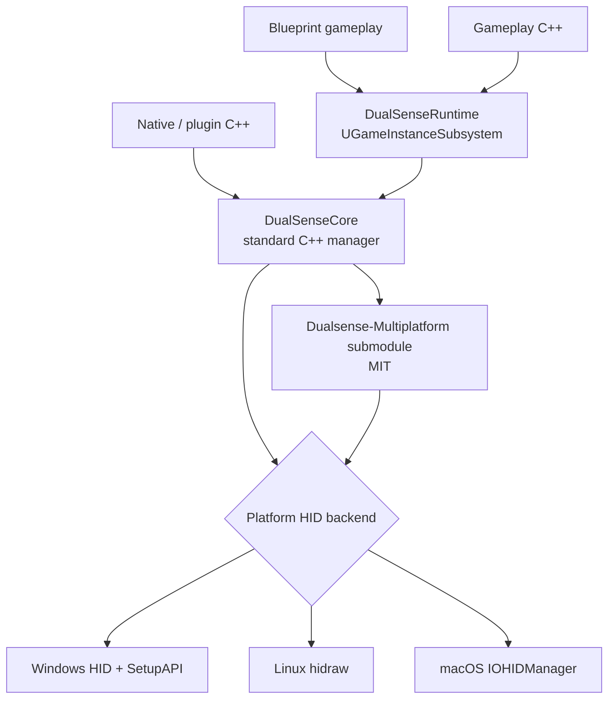

<div align="center">

# DualSense Multiplatform for Unreal Engine

**Open-source DualSense / DualSense Edge / DualShock 4 support for Unreal Engine 5.0–5.8**

Blueprint-first API • Native C++ bindings • Windows / Linux / macOS • USB + Bluetooth

[](https://github.com/DrapNard/Unreal-DualSense-Multiplatform/actions/workflows/native-ci.yml)
[](https://github.com/DrapNard/Unreal-DualSense-Multiplatform/actions/workflows/unreal-matrix.yml)
[](https://github.com/DrapNard/Unreal-DualSense-Multiplatform/releases)
[](LICENSE)

[Getting Started](Wiki/Getting-Started.md) · [Blueprint API](Wiki/Blueprint-API.md) · [C++ API](Wiki/Cpp-API.md) · [Architecture](Wiki/Architecture.md) · [Contributing](CONTRIBUTING.md)

</div>

---

## What this plugin does

This plugin wraps the [`Dualsense-Multiplatform`](https://github.com/DrapNard/Dualsense-Multiplatform) C++ library and supplies the operating-system HID layer that the upstream library intentionally leaves to engine integrations.

It exposes the controller features through a small Unreal-facing API without leaking raw GamepadCore types into gameplay code.

### Supported controller features

| Area | DualSense | DualSense Edge | DualShock 4 |
| --- | :---: | :---: | :---: |
| Buttons and sticks | ✅ | ✅ | ✅ |
| L2 / R2 analog values | ✅ | ✅ | ✅ |
| Battery / connection state | ✅ | ✅ | ✅ |
| Hot-plug detection | ✅ | ✅ | ✅ |
| Rumble | ✅ | ✅ | ✅ |
| RGB lightbar | ✅ | ✅ | ✅ |
| Smooth light transitions | ✅ | ✅ | ✅ |
| Player LEDs | ✅ | ✅ | — |
| Microphone LED | ✅ | ✅ | — |
| Adaptive triggers | ✅ | ✅ | — |
| Touchpad | ✅ | ✅ | ✅ |
| Gyroscope / accelerometer | ✅ | ✅ | ✅ |
| Edge function / paddle buttons | — | ✅ | — |
| DualSense audio settings | ✅ | ✅ | — |
| Audio-driven haptics | ✅ | ✅ | — |
| Accessibility output limits | ✅ | ✅ | ✅* |

The exact feature set also depends on transport and host OS behavior. Accessibility output limits are implemented by the Unreal layer, so unsupported hardware features are simply ignored by capability-aware gameplay. `*` DualShock 4 receives the applicable light/rumble limits only. See [Hardware Support](Wiki/Hardware-Support.md).

## Platform support

| Platform | HID backend | Notes |
| --- | --- | --- |
| Windows | SetupAPI + Windows HID | No external runtime dependency. |
| Linux | `hidraw` | No SDL/hidapi dependency. A udev rule is provided for desktop access. |
| macOS | IOKit / IOHIDManager | No third-party runtime framework. |

The Linux code is distribution-agnostic: it uses kernel `hidraw` and standard C++ rather than distro-specific packages. In practice, a distribution must still be capable of running the Unreal Engine version you target and expose Linux HID headers at build time.

## Unreal Engine support

The repository is structured for **UE 5.0 through UE 5.8**. The upstream controller core is C++20, so the module explicitly builds as C++20.

Real Unreal builds require an Unreal installation. The public GitHub-hosted CI tests the native controller layer on Windows, Linux, and macOS; the full UE 5.0–5.8 build matrix is defined for self-hosted runners with the corresponding engine installed.

## Installation

Clone the repository into your project plugin directory and initialize the library submodule:

```bash
git clone https://github.com/DrapNard/Unreal-DualSense-Multiplatform.git YourProject/Plugins/DualSenseMultiplatform
cd YourProject/Plugins/DualSenseMultiplatform
git submodule update --init ThirdParty/Dualsense-Multiplatform
```

Release ZIPs already contain the submodule source, so ZIP users do not need this Git step. The resulting layout is:

```text
YourProject/
└── Plugins/
    └── DualSenseMultiplatform/
        ├── DualSenseMultiplatform.uplugin
        └── Source/
```

Then regenerate project files if your workflow requires it and build the project normally.

### Linux permissions

The plugin talks directly to `/dev/hidraw*`. Install the supplied rule once:

```bash
sudo cp Config/99-dualsense-unreal.rules /etc/udev/rules.d/99-dualsense-unreal.rules
sudo udevadm control --reload-rules
sudo udevadm trigger
```

Reconnect the controller after installing the rule. More details are in [Linux Permissions](Wiki/Linux-Permissions.md).

## Blueprint usage

Get the **DualSense Subsystem** from your Game Instance, then use it like any other subsystem.

Typical flow:

1. Bind `On Device Connected` / `On Device Disconnected`.
2. Call `Get Connected Device Ids` or use the ID from the connection event.
3. Poll `Get State` when you need the complete raw controller state.
4. Use output nodes such as `Set Lightbar`, `Set Vibration`, or `Set Trigger Preset (Simple)`.
5. Set `Transition Duration` directly on lightbar/player-LED nodes when you want a smooth LED change (`0` remains instant).
6. Apply an accessibility preset or custom accessibility settings when the player wants reduced flashing, brightness, rumble, trigger force, or audio haptics.
7. Keep `Apply Immediately` enabled for simple use, or disable it on several non-animated setters and call `Apply Output` once to batch changes.

The common trigger path is `Set Trigger Preset (Simple)`, with usable defaults and an `Intensity` value from 0 to 1. All advanced upstream trigger modes remain exposed under the advanced trigger category, including resistance, GameCube-style, bow, galloping, weapon, machine-gun, machine, and raw 10-byte custom effects. Every Blueprint node includes an in-editor tooltip.

## C++ usage

Gameplay C++ can use the same subsystem API:

```cpp
#include "DualSenseSubsystem.h"

UDualSenseSubsystem* DualSense = GameInstance->GetSubsystem<UDualSenseSubsystem>();
if (DualSense)
{
    const TArray<int32> Devices = DualSense->GetConnectedDeviceIds();
    if (!Devices.IsEmpty())
    {
        DualSense->SetLightbar(Devices[0], FLinearColor(0.05f, 0.2f, 1.0f));
        DualSense->SetVibration(Devices[0], 180, 80);
    }
}
```

Low-level engine/plugin code can also access the native manager without going through UObject reflection:

```cpp
#include "DualSenseCoreModule.h"
#include "DualSenseCoreManager.h"

DualSense::Manager& Manager = IDualSenseCoreModule::Get().GetManager();
const std::vector<DualSense::DeviceId> Devices = Manager.GetConnectedDeviceIds();
```

The native API intentionally uses standard C++ types and remains separate from Blueprint types.

## Architecture



The important rule is that **Unreal reflection code never owns the HID protocol**. This keeps the code understandable for Unreal users while making platform work testable without launching the editor.

See [Architecture](Wiki/Architecture.md) for directory responsibilities and extension points. A complete upstream-to-plugin mapping is kept in [API coverage](Docs/API_COVERAGE.md).

## Repository layout

```text
Source/
├── DualSenseCore/
│   ├── Public/                     # Standard-C++ public manager/types
│   └── Private/
│       ├── Platform/               # Windows, Linux, macOS HID backends
│       └── ThirdParty/             # Compile bridges into upstream source
└── DualSenseRuntime/
    ├── Public/                     # UENUM/USTRUCT/subsystem Blueprint API
    └── Private/
ThirdParty/
└── Dualsense-Multiplatform/        # Git submodule pinned to an upstream commit
Tests/Native/                       # Cross-platform tests without Unreal
Wiki/                               # Source for GitHub Wiki pages
.github/workflows/                  # Native, Unreal, release, Wiki pipelines
```

## Updating Dualsense-Multiplatform

The dependency is pinned to an exact commit, while `.gitmodules` declares `main` as the update branch. Dependabot can open a PR when upstream moves; manual updates are also simple:

```bash
git submodule update --remote ThirdParty/Dualsense-Multiplatform
git add ThirdParty/Dualsense-Multiplatform
git commit -m "chore(deps): update Dualsense-Multiplatform"
```

Do not edit the submodule in-place from this repository. Put reusable fixes upstream and keep Unreal-specific workarounds in `DualSenseCore`.

## Testing

Native tests do not need Unreal or a physical controller:

```bash
cmake -S Tests/Native -B build/native -DCMAKE_BUILD_TYPE=Release
cmake --build build/native --config Release
ctest --test-dir build/native -C Release --output-on-failure
```

For an engine build:

```bash
/path/to/UE/Engine/Build/BatchFiles/RunUAT.sh BuildPlugin \
  -Plugin="$PWD/DualSenseMultiplatform.uplugin" \
  -Package="$PWD/build/plugin" \
  -TargetPlatforms=Linux \
  -Rocket
```

## Licensing

The Unreal integration is licensed under **Mozilla Public License 2.0**. If you modify MPL-covered plugin files and distribute those modified files, the MPL requires those file modifications to remain available under MPL-2.0. Your game, gameplay modules, assets, and unrelated proprietary code do **not** become MPL simply because they use the plugin.

The `ThirdParty/Dualsense-Multiplatform` git submodule remains under its upstream **MIT** license. See [THIRD_PARTY_NOTICES.md](THIRD_PARTY_NOTICES.md) and [Docs/LICENSING.md](Docs/LICENSING.md).

This repository is not affiliated with or endorsed by Sony Interactive Entertainment or Epic Games.

## Development and releases

- `main` is the primary branch.
- Conventional Commits drive automated release proposals.
- Release Please prepares semantic-version release PRs and tags.
- Native CI runs on GitHub-hosted Windows, Linux, and macOS workers.
- Unreal packaging uses self-hosted runners because those machines must provide legal Unreal Engine installations.
- Wiki pages are kept in-repo and can be published to the GitHub Wiki using the supplied workflow.

See [CI and Releases](Wiki/CI-and-Releases.md).
